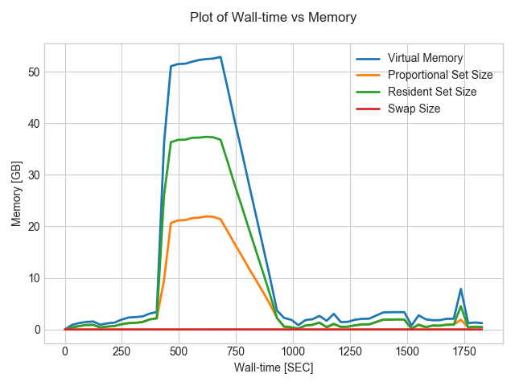
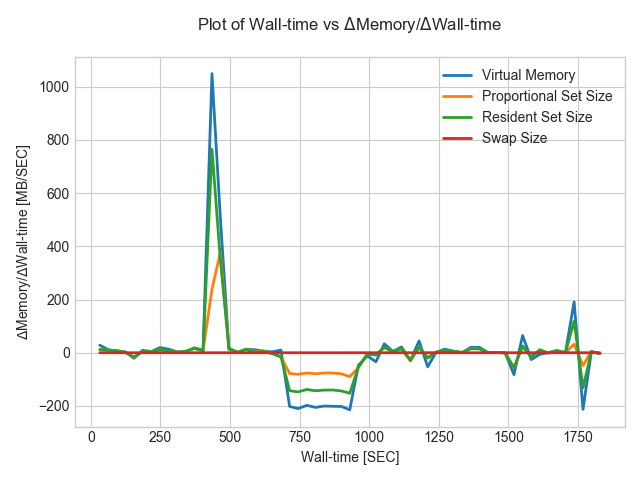
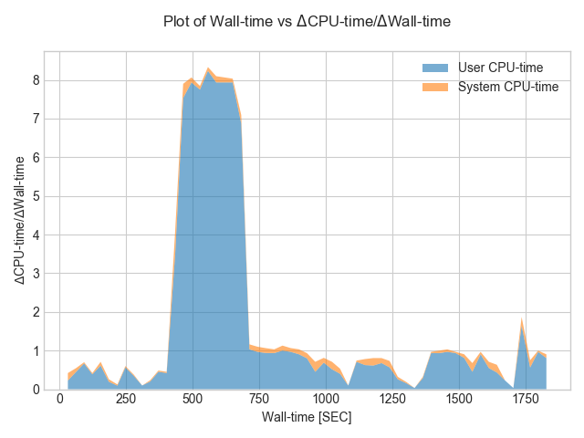

# Process Monitor (prmon)

The PRocess MONitor is a small stand alone program that can monitor
the resource consumption of a process and its children. This is 
useful in the context of the WLCG/HSF working group to evaluate
the costs and performance of HEP workflows in WLCG. In a previous
incarnation (MemoryMonitor) it has been used by ATLAS for sometime to
gather data on resource consumption by production jobs. One of its
most useful features is to use smaps to correctly calculate the
*Proportional Set Size* in the group of processes monitored, which
is a much better indication of the true memory consumption of
a group of processes where children share many pages.

prmon currently runs on Linux machines as it requires access to the
`/proc` interface to process statistics.

## Build and Deployment

### Building the project

Building prmon requires a modern C++ compiler, CMake version 3.1 or
higher and the [RapidJSON libraries](http://rapidjson.org/). Note that the installation of
RapidJSON needs to be modern enough that CMake is supported (e.g.,
on Ubuntu 16.04 `rapidjson-dev` is too old, just install it yourself).

Building should be as simple as

    mkdir build
    cd build
    cmake -DCMAKE_INSTALL_PREFIX=<installdir> <path to sources>
    make -j<number of cores on your machine>
    make install

If your installation of RapidJSON is in a non-standard location then
setting `RapidJSON_DIR` may be required as a hint to CMake.

The option `-DCMAKE_BUILD_TYPE` can switch between all of the standard
build types. The default is `Release`; use `RelWithDebInfo` if you want
debug symbols.

To build a statically linked version of `prmon` set the `BUILD_STATIC`
CMake variable to `ON` (e.g., adding `-DBUILD_STATIC=ON` to the 
command line).

Note that in a build environment with CVMFS available the C++ compiler
and CMake can be taken by setting up a recent LCG release.

### Creating a package with CPack

A cpack based package can be created by invoking

    make package

### Running the tests

To run the tests of the project, first build it and then invoke

    make test
    
## Running

The `prmon` binary is invoked with the following arguments:

```sh
prmon [--pid PPP] [--filename prmon.txt] [--json-summary prmon.json] \
      [--interval 30] [--netdev DEV] \
      [-- prog arg arg ...]
```

* `--pid` the 'mother' PID to monitor (all children in the same process tree are monitored as well)
* `--filename` output file for timestamped monitored values
* `--json-summmary` output file for summary data written in JSON format
* `--interval` time, in seconds, between monitoring snapshots
* `--netdev` restricts network statistics to one (or more) network devices
* `--` after this argument the following arguments are treated as a program to invoke 
  and remaining arguments are passed to it; `prmon` will then monitor this process
  instead of being given a PID via `--pid` 


## Outputs

In the `filename` output file, plain text with statistics written every
`interval` seconds are written. The first line gives the column names.

In the `json-summmary` file values for the maximum and average statistics
are given in JSON format. This file is rewritten every `interval` seconds
with the current summary values.

Monitoring of CPU, I/O and memory is reliably accurate, at least to within
the sampling time. Monitoring of network I/O is **not reliable** unless the
monitored process is isolated from other processes performing network I/O
(it gives an upper bound on the network activity, but the monitoring is
per network device as Linux does not give per-process network data by
default).

### Visualisation

The `prmon_plot.py` script can be used to plot the outputs of prmon from the
timestamped output file (usually `prmon.txt`). Some examples include: 

* Memory usage as a function of wall-time:
```sh
prmon_plot.py --input prmon.txt --xvar wtime --yvar vmem,pss,rss,swap
```
{:height="50%" width="50%"}

* Rate of change in memory usage as a function of wall-time:
```sh
prmon_plot.py --input prmon.txt --xvar wtime --yvar vmem,pss,rss,swap --diff
```
{:height="50%" width="50%"}

* Rate of change in CPU usage as a function of wall-time with stacked 
user and system utilizations:
```sh
prmon_plot.py --input prmon.txt --xvar wtime --yvar utime,stime --yunit SEC --diff --stacked
```
{:height="50%" width="50%"}

* The script allows the user to specify variables, their units, plotting 
style (stacked vs overlaid), as well as the format of the output image.
Use `-h` for more information.

## Developer

We're very happy to get feedback on prmon. Please raise an
[issue](https://github.com/HSF/prmon/issues) if you have a
problem or a suggestion.

Pull requests are very welcome.

### Profiling

To build prmon with profiling set one of the CMake variables
`PROFILE_GPROF` or `PROFILE_GPERFTOOLS` to `ON`. This enables
GNU prof profiling or gperftools profiling, respectively.
If your gperftools are in a non-standard place, pass a hint
to CMake using `Gperftools_ROOT_DIR`.


# Copyright

Copyright (c) 2018, CERN.

 
